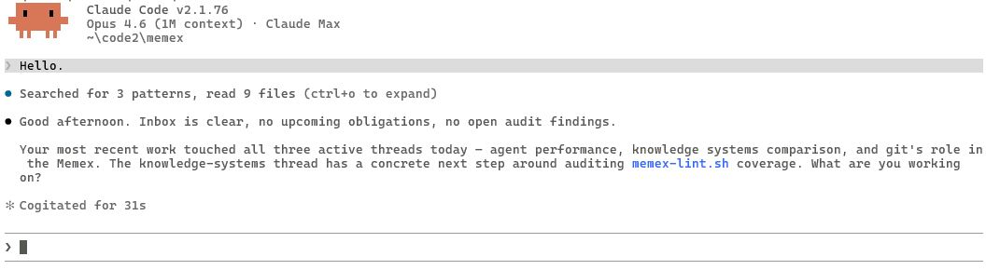
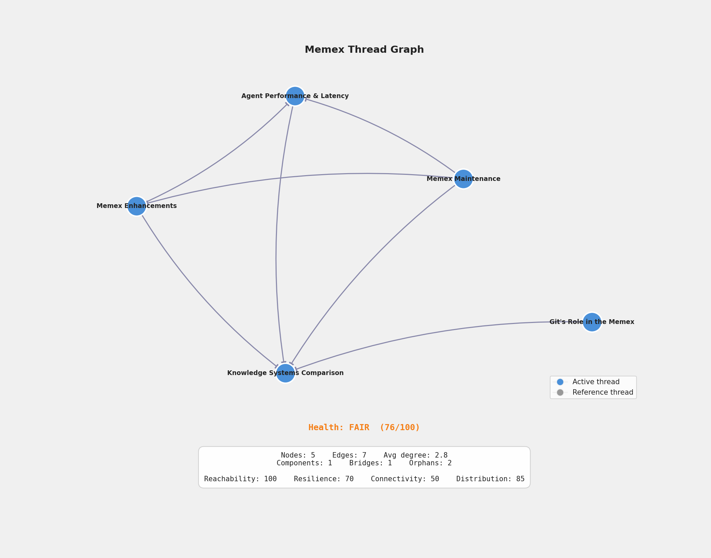

# Memex

## A persistence architecture that gives stateless LLMs continuous intelligence.

Memex is a governed markdown knowledge structure that LLMs maintain
and update across sessions. 

Instead of storing memories in opaque
model features or vector databases, the system maintains a transparent
wiki-like repository with explicit lifecycle rules.

The result: conversations that continue across sessions without
fine-tuning, proprietary infrastructure, or large context windows.

---

## What this means for you

**This repo is a working example.** The showcase is the Memex itself — the threads, cross-references, artifacts, enforcer reports, and the governance that holds them together. `tinyagent/` is just a small example Python project that gives the Memex something to manage; the code is not the point. The fictional PI ("Ren") demonstrates what a populated identity looks like. Browse it on GitHub to see how the pieces fit together. When you're ready to build your own, clear the content and start fresh — the architecture and machinery carry over.

Here's what using your own Memex looks like:

Launch an agentic coding tool (Claude Code, Codex CLI, or Gemini CLI) from the repo root and start working as you would for any research project.

If the conversation is sufficient, Claude Code will save a thread for you automatically.  If you hit a point that is important to you, you can also say "let's make a note of this", or "let's record this please".  

This is how you will start to build a body of "threads" in the Memex.  Claude Code will maintain the threads and connections because it will follow the rules (constitution.md)

At a certain point, ask Claude Code to propose an idea or plan based on the threads you have built.  Now launch Codex from the repo root, and ask Codex to write a formal review of the plan.  Return to Claude Code and ask for an assessment of the Codex review.

Soon you will be researching with a primary agent (Claude Code) and an "enforcer" (Codex).  Codex — unemotional, cold — is suited for the enforcer role.  This is the best configuration we have found.  

Now close the session. Walk away. Come back tomorrow.

Start a new session with Claude Code and watch as it knows where to begin again — what you were working on, what's still open, and what to load to continue your research across sessions.

---



---

## Multi-model architecture

The rules file (constitution.md) is the interface contract. Any model that can read markdown and follow instructions can attempt to operate the Memex — but models vary in how reliably they follow governance rules, just as people do.

We handed this repo to OpenAI's Codex — no prompt engineering, no model-specific tuning. Just the rules file and the wiki. Codex didn't just read it — it operated in it. It assumed the enforcer role (auditing the wiki, producing reports), and it assumed the primary agent role upon request (updating pages, creating threads, providing substantive feedback).

Three vendors' models (Claude, Gemini, Codex) can all run on the same architecture, governed by the same rules file.  

Be warned however, that different models have a different temperament around following rules, just as humans do.  The best configuration for research is Claude Code as primary agent and Codex as an enforcer and critical reviewer.

The architecture outlives any individual model. The governance is in the files. 

---

## Adversarial design

Governance rules are only as good as the ability to enforce them. This system was designed through adversarial iteration: the human and Claude develop a plan together, Codex reviews it critically, and the human and Claude assess the review — repeating until the design holds up under scrutiny. Good governance produces better architecture. Audited process can be improved; unaudited process can only be trusted.

The human role is not supervisory — it is architectural. The human is the principal investigator: directing research, weighing competing model assessments, and deciding which structural changes to accept. This requires reasoning across multiple levels of the design simultaneously.

---

## Not a message board, not a wiki

It borrows from both. Cross-linked pages from wikis. Thread lifecycle from message boards. But the thing it does that neither can:

### The knowledge layer maintains itself.

A wiki requires humans to keep it current. A message board lets everything sink under new activity. The Memex updates its own pages as a side effect of conversation — documentation nobody has to write.

### Orientation is pre-loaded, not searched.

A wiki waits for you to search it. A message board waits for you to browse it. The Memex loads your active working set before you say anything. The LLM already knows what you were working on yesterday.

### Governance is machine-readable.

A wiki has moderation norms. A message board has house rules. The Memex has an executable constitution — what to capture, what to ignore, when to compress, when to archive, who can do what. Encode the rules once, and the system can check its own compliance — mechanically, every session.

### A hard budget prevents infinite growth.

Wikis grow forever. Message boards decay forever. The Memex keeps a fixed working set (~400 lines — roughly 8K tokens, leaving room for conversation in a 128K context window) and demotes everything else to reference. Active topics stay on the desk. Cold topics move to the filing cabinet. Nothing is deleted — it just costs less to carry.

### Importance is behavioral, not declared.

Wikis don't know what matters. Message boards use votes and views. The Memex tracks what you actually return to. The system self-organizes around real attention, not stated priorities.

---

## Efficient context preloading

Usable context is not the same as loading everything. The system is designed so that total context cost per session stays fixed — regardless of how large the archive grows.

### Three tiers, one working set

**Active threads** (5-8 files) load every session. These are your current topics — what you're working on this week. Hard-capped at ~400 lines total. This is the desk.

**Lightweight threads** live in the repo but never auto-load. They hold reference material, cooled-off topics, background knowledge. The LLM navigates to them on demand through cross-references — not search, not retrieval, but following links the way you'd click through a wiki.

**Artifacts** are deep records — synopses, research notes, conversation captures. Write-once, read-rarely. They exist to be *findable*, not to be in working memory. Tagged frontmatter and summaries let the LLM decide whether to load the full file.

### What connects the tiers

Every thread carries annotated cross-references — not just "see also" but *why the link exists*. The LLM enters through the active threads it already loaded and follows links outward as the conversation requires. The design constraint: any topic should be reachable within 3 hops from any other topic in the graph. The graph is the index. No central lookup table needed.

### What keeps it lean

- **Summaries as gatekeepers.** Every thread has a 2-4 sentence summary. The LLM can triage a directory by reading summaries without loading full files.
- **Frontmatter as metadata.** Tags, hit counts, last-touched dates — all in the first 6 lines. Enough to decide relevance without reading the body.
- **Compression as demotion.** When a thread gets too long or too stale, it compresses into a lighter form or splits into parts. Information moves deeper, not out.
- **The inbox separates capture from organization.** New thoughts get dropped in one file. The LLM triages them at session open. No mid-conversation restructuring.
- **The constitution is the boot sequence.** A new session reads one file, follows its procedure, loads the working set, and is oriented. Fixed cost, every time.

---

## How it stays honest

LLMs drift. They misinterpret rules, take shortcuts, and silently degrade state over time. A governed system that depends on good behavior isn't governed — it's lucky. The Memex addresses this with three layers of integrity checking.

### The enforcer

The writer never reviews its own work. A different model — from a different vendor — audits the Memex read-only and produces reports. It checks for contradictions between files, missing cross-references, structural drift from the constitution, and bloat. It does not edit. It reports. The human reviews the findings and decides what to act on.

This is not optional redundancy. It is the mechanism that turns soft governance into something closer to hard governance. Same-model review catches formatting errors. Cross-model review catches assumption errors.

### The lint script

`.memex/scripts/memex-lint.sh` is a deterministic mechanical check — no model required. It verifies compression budgets, thread sizes, frontmatter structure, cross-reference integrity, and orphan detection. It answers the question: does the Memex comply with its own constitution right now?

The lint script catches what models miss: silent structural decay. A thread that grew past 60 lines. A cross-reference pointing to a file that was renamed. An artifact missing required frontmatter fields. These are not judgment calls — they are invariant violations that a shell script can flag in seconds.

### The rendered wiki

`.memex/scripts/generate_wiki.py` and `.memex/scripts/generate_markdown.py` render the thread graph into human-readable documentation. This is the third check: the human reads the output. Threads that looked fine as individual files may reveal gaps, redundancies, or broken narratives when rendered as a coherent document.

The rendered wiki is an audit surface, not just a presentation layer. If something is wrong in the Memex, you'll see it in the wiki before you see it in the files.

### The honest assessment

Is this airtight? No. The enforcer can miss things. The lint script only catches what it's programmed to check. The wiki render depends on someone reading it. But the combination — model audit, mechanical check, human review — creates overlapping coverage that no single layer provides alone. The system degrades gracefully rather than silently.

---

## Getting started

**To browse**: read this repo on GitHub. Start with `memex/active-threads/context-budget-economics.md` and follow the cross-references.

**To build your own**: clone the repo, then use the spawn script to create a fresh Memex with just the portable skeleton — no example content to clean up:

```bash
git clone https://github.com/cumberland-laboratories/memex.git
cd memex
python .memex/scripts/spawn.py /path/to/your-new-project
```

Or do it manually: delete the example content (`memex/active-threads/*`, `memex/artifacts/*`, `memex/threads/*`, `tinyagent/`), reset `identity.md` and `mission.md` to your own, and start working. The `.memex/` machinery and constitutions carry over unchanged.

---

## Repo structure

```
constitution-core.md         ← portable governance (roles, lifecycle, conventions)
constitution.md              ← domain rules for this instance
.memex/                      ← portable machinery (don't modify)
  scripts/                   ← CLI, lint, wiki generation, graph health
  procedures/                ← session lifecycle, thread lifecycle, audits
  policies/                  ← concierge decision trees
  roles.yaml                 ← role definitions (PI, agent, enforcer, crawler)
memex/                       ← the knowledge graph
  identity.md                ← who you are (you fill this in over time)
  mission.md                 ← what you're building and why
  inbox.md                   ← zero-friction capture (drop anything here)
  active-threads/            ← current topics (loaded every session)
  threads/                   ← reference threads (loaded on demand)
  artifacts/                 ← deep records, decision records (loaded on demand)
  reference-notes/           ← design rationale and cognitive aids
  vault/                     ← external files: PDFs, papers (gitignored)
tinyagent/                   ← illustrative project (pure Python coding assistant)
docs/                        ← systems docs, reports, wiki renders
```

---

## The thread graph



The graph is auto-generated by `python .memex/scripts/graph_health.py`. Nodes are threads. Edges are annotated cross-references. Colors are clusters detected by community analysis. The health score below the graph is computed across five dimensions: navigability, resilience, connectivity, efficiency, and legibility.

This graph scores 70/100. That's honest. The five bridge edges and 23% redundancy reflect a small, focused project — eleven threads about one topic. A production Memex with broader interests would have more clusters, more redundant paths, and a higher score.

What it would *not* have is 100/100, and that's by design.

### The multi-interest principle

A personal Memex serves multiple unrelated interests. A thread about family history has no natural bridge to a thread about Fourier analysis, and that is fine. The graph health tooling is designed to recognize this: it flags forced connections as worse than honest gaps. A high score achieved through artificial links is worse than a lower score with genuine ones.

The annotation on every cross-reference must explain *why* the link exists — not just that it improves a metric. When the community detection algorithm places unrelated threads in the same cluster, the system notes the artifact and moves on rather than manufacturing a connection. Semantic integrity over graph score. Always.

---

## License

MIT. See [LICENSE](LICENSE).
